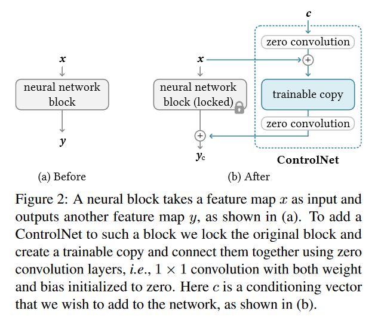
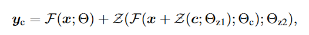
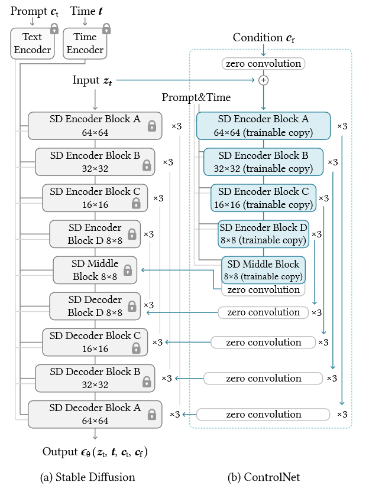
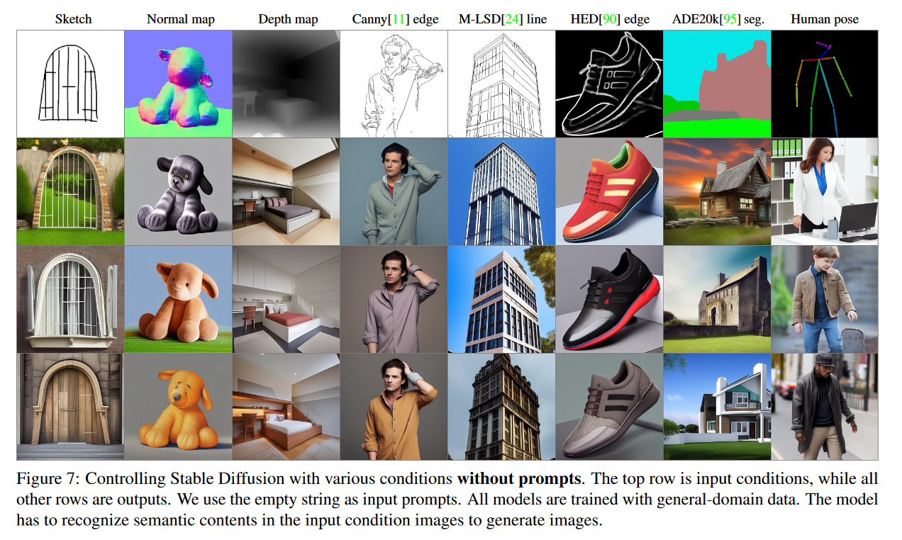

# 解决了什么问题
- 允许Stable Diffusion增加额外信息
- # 怎么解决的
- 提出了ControlNet，是一个网络架构，可以应用在可以增强具有空间局部化、特定任务图像条件的大型预训练text-to-image扩散模型
- ## ControlNet的基本架构
- 
- 图中a为原方法，b为添加了ControlNet后的方法，b中的"trainable copy"模块为原模块的复制，同时将原模块中的参数锁定。可训练模块的输入为外部条件向量c。下图所示的公式表示了$$y_c$$的计算过程，其中F为"neural network block"，Z为"zero convolution"
- 
- 以下是以"Stable Diffusion"为例，使用ControlNet的图例
- 
- # 相比原有方法，有什么优势
- 
- 效果方面：stable diffusion是通过给定一定的关键词生成图片，在增加了ControlNet后可以在已有关键词的基础上给出一定的图片限制，而新模型可以在限制图片的架构基础上生成与之相似的图片
- （资源损耗